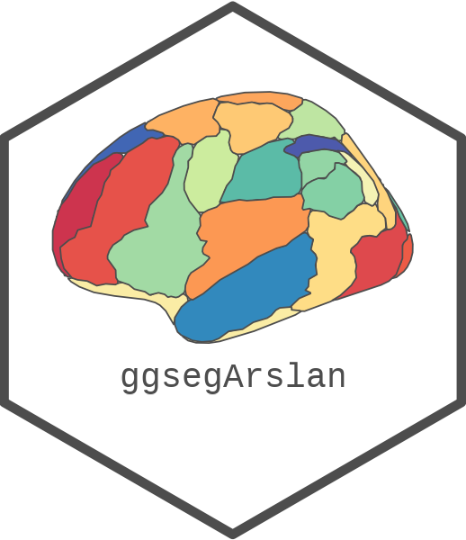
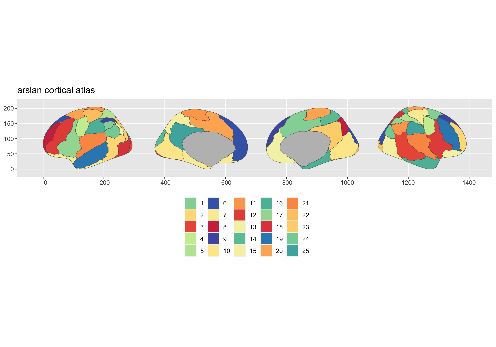
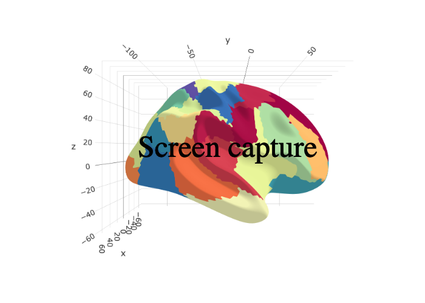

<!-- README.md is generated from README.Rmd. Please edit that file -->

# ggsegArslan 

<!-- badges: start -->
<!-- badges: end -->

This package contains dataset for plotting the
[arslan](add%20url%20here) atlas ggseg and ggseg3d.

Arslan, S., & Rueckert, D. (2015, October). Multi-level parcellation of
the cerebral cortex using resting-state fMRI. In International
Conference on Medical Image Computing and Computer-Assisted Intervention
(pp. 47-54). Springer, Cham.
[SpringerLink](https://link.springer.com/chapter/10.1007/978-3-319-24574-4_6)

To learn how to use these atlases, please look at the documentation for
[ggseg](https://ggseg.github.io/ggseg/) and
[ggseg3d](https://ggseg.github.io/ggseg3d)

## Installation

We recommend installing the ggseg-atlases through the ggseg
[r-universe](https://ggseg.r-universe.dev/ui#builds):

``` r
# Enable this universe
options(repos = c(
    ggseg = 'https://ggseg.r-universe.dev',
    CRAN = 'https://cloud.r-project.org'))

# Install some packages
install.packages('ggsegArslan')
```

You can install the released version of ggsegArslan from
[GitHub](https://github.com/) with:

``` r
# install.packages("remotes")
remotes::install_github("ggseg/ggsegArslan")
```

``` r
library(ggseg)
#> Loading required package: ggplot2
library(ggseg3d)
library(ggsegArslan)

plot(arslan) +
  theme(legend.position = "bottom", 
        legend.text = element_text(size = 9)) +
  guides(fill = guide_legend(ncol = 6))
```



``` r
library(dplyr)
ggseg3d(atlas = arslan_3d) %>% 
  add_glassbrain() %>% 
  pan_camera("right lateral")
```



Please note that the ‘ggsegArslan’ project is released with a
[Contributor Code of Conduct](CODE_OF_CONDUCT.md). By contributing to
this project, you agree to abide by its terms.
